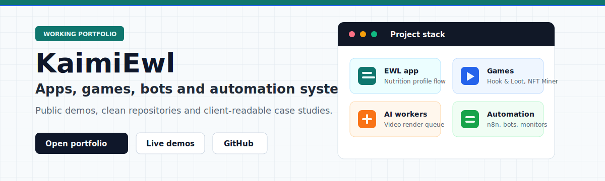

  

**Working apps, games, bots and automations. Built to be opened, tested and shown.**

## Start Here

| Open | What it shows | Link |
| --- | --- | --- |
| Portfolio | One clean page with the strongest public work grouped by outcome. | [kaimiewl.github.io](https://kaimiewl.github.io/) |
| Easy Weight Loss | Mobile profile flow for goals, calories and nutrition settings. | [Live app](https://kaimiewl.github.io/EWL/profile/) |
| Hook & Loot | Playable browser fishing game with rewards and upgrades. | [Play game](https://kaimiewl.github.io/fishing-game/) |
| Lina Monitor | AI influencer workspace for monitoring, posts and comments. | [Open monitor](https://n8ncodex.freen8n.space/lina-monitor/) |

## Featured Work

<table>
  <tr>
    <td width="50%">
      <h3>Easy Weight Loss Profile App</h3>
      
Phone-first profile and nutrition target flow with local persistence and a clean app-style UI.

      
<a href="https://kaimiewl.github.io/EWL/profile/">Live app</a> / <a href="https://github.com/KaimiEwl/ewl-nutrition-pwa">Code</a>

    </td>
    <td width="50%">
      <h3>Hook &amp; Loot Fishing Game</h3>
      
Playable browser game with rewards, upgrades and a simple loop that works on public GitHub Pages.

      
<a href="https://kaimiewl.github.io/fishing-game/">Play</a> / <a href="https://github.com/KaimiEwl/fishing-game">Code</a>

    </td>
  </tr>
  <tr>
    <td width="50%">
      <h3>AI Video Render Worker</h3>
      
Queue-based worker for AI voice, subtitle generation, ffmpeg rendering and final video delivery.

      
<a href="https://github.com/KaimiEwl/ai-video-render-worker">Code</a>

    </td>
    <td width="50%">
      <h3>BROAGENTS Browser Runtime</h3>
      
Chrome extension and dashboard for coordinating multiple AI browser agents from one runtime.

      
<a href="https://github.com/KaimiEwl/broagents-browser-ai-runtime">Code</a>

    </td>
  </tr>
  <tr>
    <td width="50%">
      <h3>TGM Coin Bot</h3>
      
Telegram rewards, referrals, balances and community admin controls for bot-driven communities.

      
<a href="https://github.com/KaimiEwl/tgm-coin-bot">Code</a>

    </td>
    <td width="50%">
      <h3>Automation Systems</h3>
      
Self-hosted n8n workspaces, monitors, workflow exports and public-safe automation case studies.

      
<a href="https://github.com/KaimiEwl/ai-automation-case-studies">Case studies</a>

    </td>
  </tr>
</table>

## What I Build

- Client-facing apps, dashboards, landing pages and mobile-style flows.
- Telegram bots, admin tools, reward systems and community automation.
- AI workflows, n8n systems, API integrations and background workers.
- Video generation pipelines with queues, voice, subtitles and ffmpeg.
- Browser games, visual demos and MVP prototypes.

## Public-Safe By Design

Private credentials, workflow secrets, local databases, runtime logs and generated media are intentionally not published. Public repositories show clean code exports, screenshots, setup notes and architecture context.
